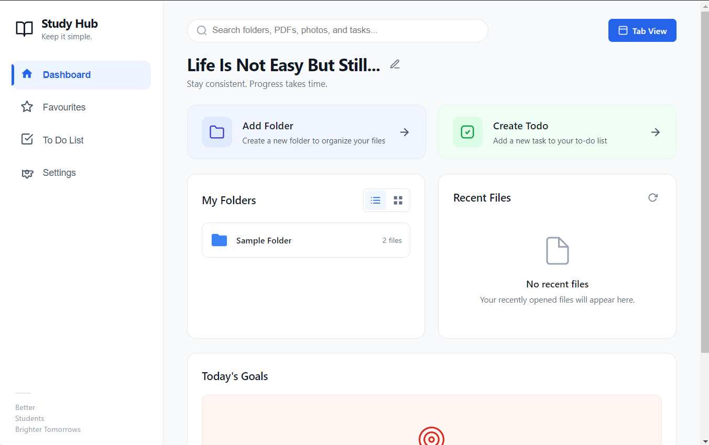
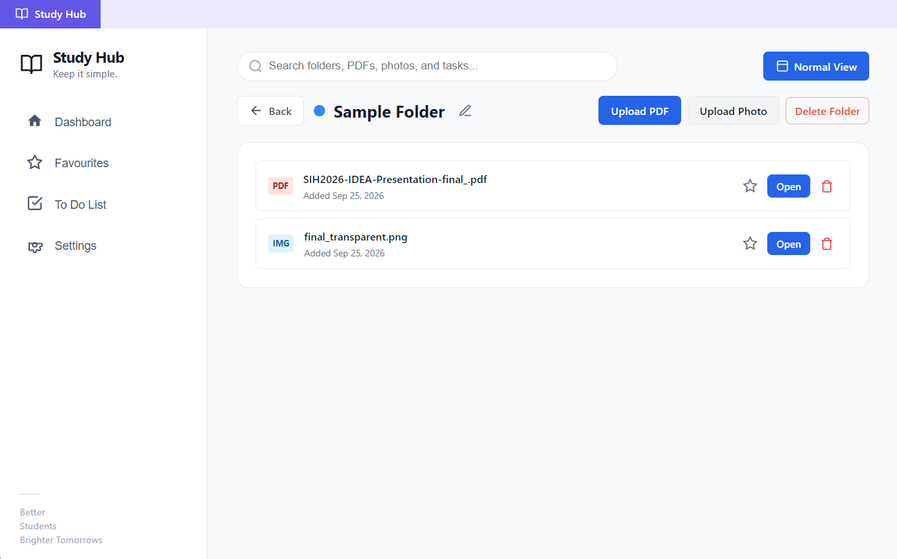
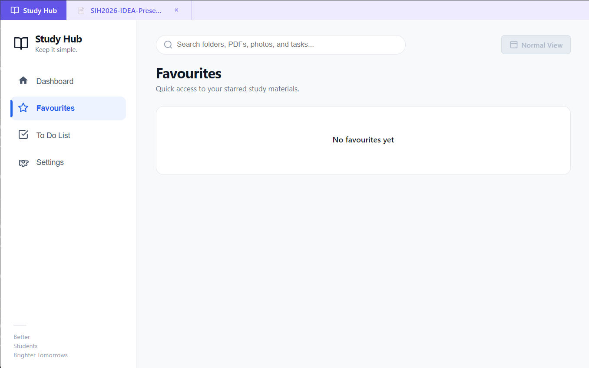
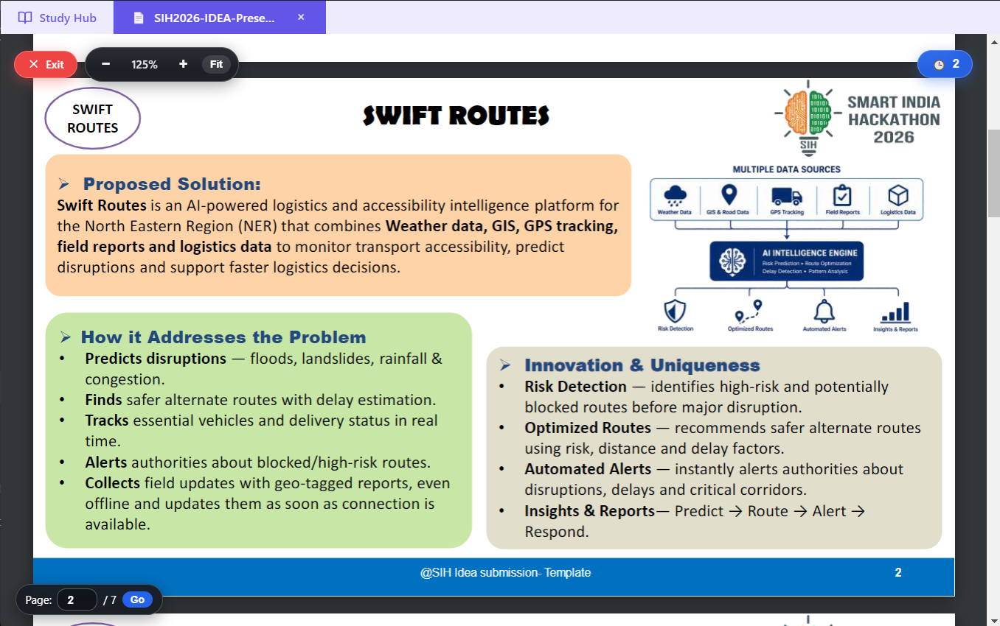
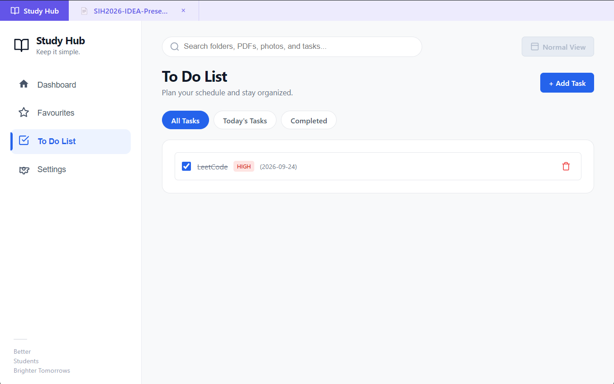

# Study Hub

Study Hub is a lightweight desktop study organizer built with Electron, HTML, CSS, and JavaScript.

It is designed to keep study materials, notes, PDFs, photos, favourites, recent files, and daily tasks organized in one simple desktop application.

## Features

### 📁 Folder Management
- Create folders to organize study materials
- Choose a different colour for each folder
- Rename folders
- Delete folders and their stored files
- Switch between block and list folder views

### 📄 PDF Management
- Upload PDF study materials
- Open PDFs inside the application
- Page navigation and page jumping
- Zoom in and zoom out
- Fit-to-width viewing
- Save and restore the last reading position
- Open multiple documents using tabs

### 🖼️ Photo Management
- Upload study-related images
- View images inside the application
- Zoom and reset controls
- Drag images around the viewer

### ⭐ Favourites
- Star important PDFs and photos
- Access starred files from the Favourites section
- Remove files from Favourites with one click

### 🕒 Recent Files
- Automatically track recently opened files
- Quickly reopen recent study materials
- Clear recent history without deleting files

### ✅ To-Do List
- Create daily tasks
- Set task priority
- Assign dates
- Mark tasks as completed
- Filter tasks by all, today, and completed

### 🔎 Global Search
Search across:
- Folders
- PDFs
- Photos
- To-do tasks

### 🌙 Theme Support
- Light mode
- Dark mode
- Theme preference is saved locally

### 🗂️ Tab View
- Open multiple documents in separate tabs
- Switch between open documents
- Close individual document tabs
- PDF and image viewers work inside tabs

### 💾 Local Storage
Study Hub stores application data locally using IndexedDB.

Your folders, files, favourites, reading positions, tasks, and settings are stored locally on the device.

## Screenshots

### Dashboard



### Folder View



### Favourites



### PDF Viewer



### To-Do List



## Tech Stack

- Electron
- HTML5
- CSS3
- JavaScript
- IndexedDB
- PDF.js

## Project Structure

```text
Study_Hub_project/
├── .github/
│   └── workflows/
│       └── build-windows.yml
├── build/
├── screenshots/
├── index.html
├── style.css
├── script.js
├── main.js
├── preload.js
├── package.json
├── package-lock.json
├── electron-builder.json
├── installer.nsi
├── build.bat
└── README.md
